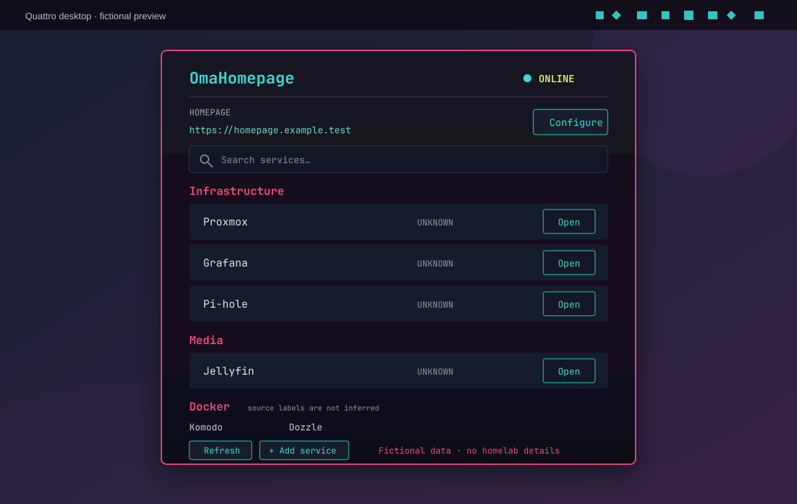

# OmaHomepage

OmaHomepage is an independent native Omarchy/Quickshell plugin for browsing services from a gethomepage/Homepage dashboard. It includes a bar widget and a service that polls Homepage's `GET /api/services`, lets you search and open service links, and can optionally add a service or edit `services.yaml` through Homepage's MCP API.



Every listed service is marked `UNKNOWN`: Homepage's service API describes configuration and does not establish whether the service backend is reachable. Docker-linked metadata may be displayed when Homepage returns `server` or `container`, but `/api/services` does not identify whether a row came from YAML, Docker, or another source. The plugin does not connect to the Docker socket or run service health probes.

## Requirements

- Omarchy with native plugin support (Quickshell)
- Homepage with `GET /api/services` enabled
- `curl` 8.4 or newer available in `/usr/bin` or `/bin` (the response-size cap must apply to streaming responses)
- For optional MCP editing: Homepage MCP enabled, a user-created MCP token, `secret-tool`, and a Secret Service provider

## Install and configure

For a local checkout, copy the plugin directory into Omarchy's plugin directory, then rescan and add its bar widget. Replace `<checkout>` with this repository's path; the guard avoids overwriting an existing installation.

```sh
checkout=/path/to/omarchy-homepage
plugin_id=com.blogvirtualizado.omaops.homepage
plugin_dir="${XDG_CONFIG_HOME:-$HOME/.config}/omarchy/plugins/$plugin_id"
test ! -e "$plugin_dir" || { echo "Plugin directory already exists: $plugin_dir" >&2; exit 1; }
mkdir -p "$(dirname "$plugin_dir")"
mkdir -p "$plugin_dir"
tar --exclude=.git -C "$checkout" -cf - . | tar -C "$plugin_dir" -xf -
omarchy-shell shell rescanPlugins
omarchy bar put "$plugin_id"
```

Remove a local test copy with `omarchy plugin disable "$plugin_id"`, delete the exact `$plugin_dir` directory, and run `omarchy-shell shell rescanPlugins` again.

Once the repository is hosted, the normal Git-managed install is `omarchy plugin add https://github.com/danielfuentespl/omarchy-homepage.git --enable`; remove it later with `omarchy plugin remove com.blogvirtualizado.omaops.homepage`.

Set the Homepage address in Omarchy's plugin settings or in the panel's **Configure** form. Use an HTTP(S) address, optionally with a safe path; credentials, query strings and fragments are rejected. **Open Homepage** uses this address. Homepage documents its `base` setting as the document base URL; its current UI calls `/api/services` with a root-relative path, so OmaHomepage addresses the services and MCP APIs at the URL origin (`/api/services` and the configured `mcpPath`). A reverse proxy must route those API paths as Homepage expects; the plugin does not assume the document path is an API prefix. HTTPS certificate checks remain on. For a private CA, set the absolute PEM certificate path in plugin settings. No homelab address is built in.

You can also configure the bar widget from a terminal:

```sh
omarchy bar set com.blogvirtualizado.omaops.homepage baseUrl "https://homepage.example.com"
```

The panel refreshes `/api/services`, filters by group/name/description and opens safe HTTP(S) links through the desktop. The API connection state says whether Homepage replied; each service status stays `UNKNOWN`.

If Homepage has `HOMEPAGE_AUTH_ENABLED=true`, `/api/services` requires the Homepage browser session. The MCP bearer token does not authorize this API endpoint, so the service list may show **AUTH REQUIRED** even when MCP editing works. This release does not ask for or persist a Homepage session cookie.

## Optional MCP editing

Homepage MCP is opt-in. Set `HOMEPAGE_MCP_ENABLED=true` in Homepage and configure its MCP token as described in the [Homepage MCP documentation](https://gethomepage.dev/configs/mcp/). For writes, Homepage must also have `HOMEPAGE_MCP_ALLOW_WRITE=true`. In Omarchy plugin settings, explicitly enable **Homepage configuration editing**. The plugin does not contact MCP or Secret Service while this setting is off.

Store the token locally without putting it in shell history, arguments, or plugin settings:

```sh
./scripts/store-secret default
```

MCP is blocked unless the configured base address uses HTTPS; the token is never sent to an HTTP endpoint. The panel uses Secret Service attributes `application=omaops-homepage` and `instance=default`. Change `secretId` in plugin settings and pass the same ID to the script when storing another token. Remove a token with:

```sh
secret-tool clear application omaops-homepage instance default
```

After opt-in, the panel checks Homepage's MCP capabilities. **+ Add service** adds a validated HTTP(S) link, confirms the change, then verifies the `services.yaml` result. **Edit services.yaml** reads that file only after you click the button; **Validate & Save** validates first, asks for explicit confirmation, writes, and reads the content back. If a write succeeds but read-back cannot verify it, the editor offers an explicitly confirmed restore using the last verified in-memory version. Concurrent Homepage edits may be overwritten by that restore, so review the warning before confirming. The editor keeps its draft in panel memory only; it does not write a local cache or clipboard.

Structured editing of an existing individual service is planned for a later release. Raw YAML editing is used because parsing and reserializing the whole file could change comments, ordering, anchors, or formatting. The Homepage API does not reliably identify whether each returned service came from `services.yaml` or Docker discovery. OmaHomepage therefore does not claim Docker provenance or offer per-row edit controls; Docker `server`/`container` hints may be shown when the API returns them.

### MCP token scope

Treat the Homepage MCP token as a broad administrative credential. Homepage documents that the token can read configured credentials and, when write access is enabled, can modify more than `services.yaml` (including `custom.js`). OmaHomepage restricts its own buttons to a small allowlist of MCP tools and targets the service file, but it cannot reduce the authority granted by Homepage to the token itself. Use a dedicated token, keep editing off when not needed, and secure Homepage accordingly. Do not enable Homepage MCP writes if you do not accept this scope.

## Data and security

- curl uses `-q --config -`; generated options and the token are sent through stdin, not command-line arguments or environment variables.
- Redirects are never followed. HTTPS verifies the system trust store or the explicitly selected CA; there is no insecure TLS mode.
- API response sizes and displayed fields are bounded. Widget credentials and unknown fields are ignored.
- Safe HTTP(S) links are opened by Qt without shell command construction.
- The plugin runs in `omarchy-shell` and is not a sandbox boundary. No Docker socket, SSH, browser cookies, or Homepage credentials are accessed.
- See [Security notes](docs/SECURITY.md).

## Development

Run checks on a machine with Omarchy installed:

```sh
./tests/run
omarchy plugin validate .
git diff --check
```

Tests use synthetic data, an in-memory Homepage MCP fixture, and temporary HTTP/TLS servers with a temporary CA; they do not contact your Homepage instance. The runner prints each suite's pass/skip counts. Network tests need local loopback access and explicitly skip when a local sandbox blocks it; CI fails if those integration tests cannot run. See [Development](DEVELOPMENT.md).

## Project

- Version: `0.1.0`
- License: MIT
- Independent project; not affiliated with, sponsored by, or endorsed by Homepage or Omarchy.
