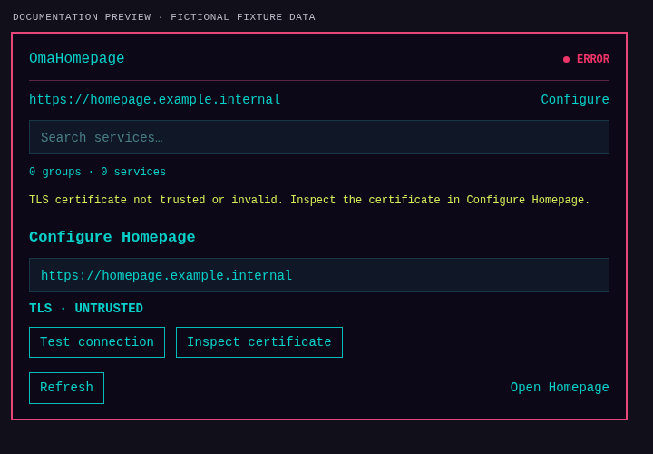
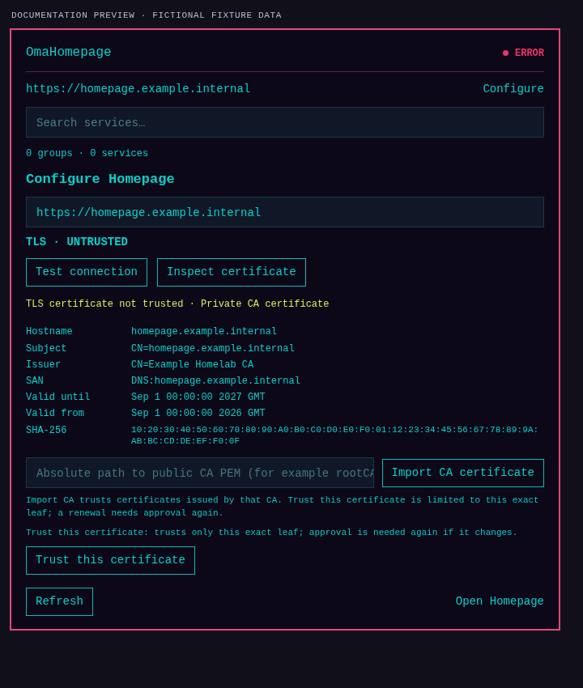
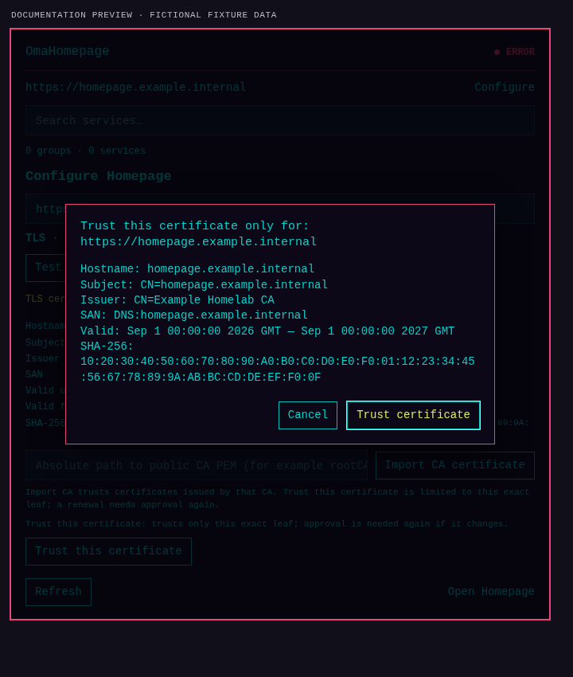
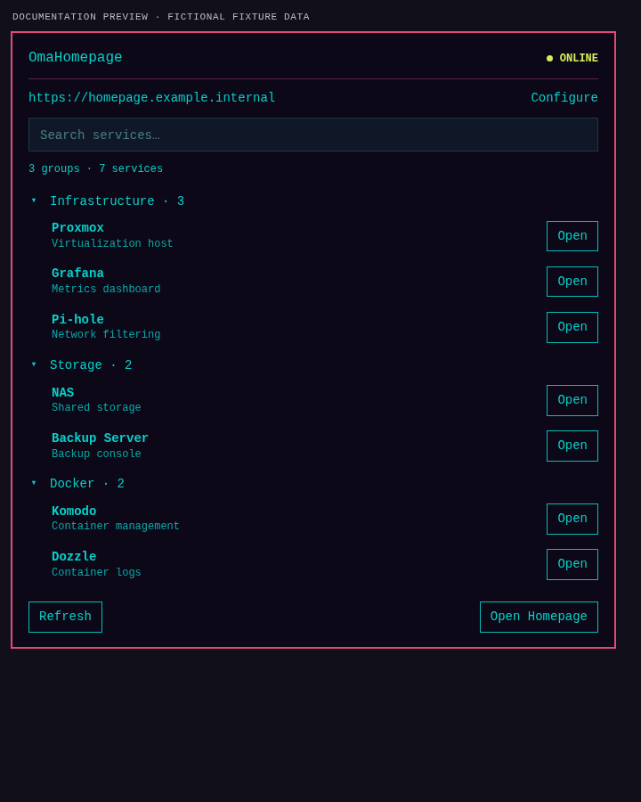

# OmaHomepage

OmaHomepage is an independent native Omarchy/Quickshell plugin for browsing services from a gethomepage/Homepage dashboard. It includes a bar widget and a service that polls Homepage's `GET /api/services`, lets you search and open service links, and can optionally inspect MCP capabilities and view `services.yaml` through Homepage's read-only MCP API.


Every listed service is marked `UNKNOWN`: Homepage's service API describes configuration and does not establish whether the service backend is reachable. Docker-linked metadata may be displayed when Homepage returns `server` or `container`, but `/api/services` does not identify whether a row came from YAML, Docker, or another source. The plugin does not connect to the Docker socket or run service health probes.

## Requirements

- Omarchy with native plugin support (Quickshell)
- Homepage with `GET /api/services` enabled
- `curl` 8.4 or newer available in `/usr/bin` or `/bin` (the response-size cap must apply to streaming responses)
- For optional MCP read-only access: Homepage MCP enabled, a user-created MCP token, `secret-tool`, and a Secret Service provider

## Install and configure

For a local checkout, copy the plugin directory into Omarchy's plugin directory, then rescan and add its bar widget. Replace `<checkout>` with this repository's path; the guard avoids overwriting an existing installation.

```sh
checkout=/path/to/omarchy-homepage
plugin_id=com.blogvirtualizado.omaops.homepage
plugin_dir="${XDG_CONFIG_HOME:-$HOME/.config}/omarchy/plugins/$plugin_id"
test ! -e "$plugin_dir" || { echo "Plugin directory already exists: $plugin_dir" >&2; exit 1; }
mkdir -p "$(dirname "$plugin_dir")"
mkdir -p "$plugin_dir"
tar --exclude=.git -C "$checkout" -cf - . | tar -C "$plugin_dir" -xf -
omarchy-shell shell rescanPlugins
omarchy bar put "$plugin_id"
```

Remove a local test copy with `omarchy plugin disable "$plugin_id"`, delete the exact `$plugin_dir` directory, and run `omarchy-shell shell rescanPlugins` again.

Once the repository is hosted, the normal Git-managed install is `omarchy plugin add https://github.com/danielfuentespl/omarchy-homepage.git --enable`; remove it later with `omarchy plugin remove com.blogvirtualizado.omaops.homepage`.

Set the Homepage address in Omarchy's plugin settings or in the panel's **Configure** form. Use an HTTP(S) address, optionally with a safe path; credentials, query strings and fragments are rejected. **Open Homepage** uses this address. Homepage documents its `base` setting as the document base URL; its current UI calls `/api/services` with a root-relative path, so OmaHomepage addresses the services and MCP APIs at the URL origin (`/api/services` and the configured `mcpPath`). A reverse proxy must route those API paths as Homepage expects; the plugin does not assume the document path is an API prefix. HTTPS certificate checks remain on. In **Configure Homepage**, use **Test connection** to check system trust and inspect a presented certificate. For an untrusted but hostname-valid certificate, **Trust this certificate** confirms and trusts only that exact public leaf; OmaHomepage first tests a real `/api/services` request with curl and keeps the trust only if TLS succeeds. A renewed leaf requires another confirmation. **Import CA certificate** remains available for a public PEM CA after validating the live server chain and hostname; it continues to trust certificates issued by that CA. Both trust methods are scoped to the exact Homepage origin and stored in a private directory under `~/.config/omaops/homepage/trust/`. No homelab address is built in.

## Screenshots

### Private CA detected



### Inspect and explicitly trust the certificate



### Confirm the certificate fingerprint



### Connected to Homepage



You can also configure the bar widget from a terminal:

```sh
omarchy bar set com.blogvirtualizado.omaops.homepage baseUrl "https://homepage.example.com"
```

The panel refreshes `/api/services`, filters by group/name/description and opens safe HTTP(S) links through the desktop. The API connection state says whether Homepage replied; each service status stays `UNKNOWN`.

If Homepage has `HOMEPAGE_AUTH_ENABLED=true`, `/api/services` requires the Homepage browser session. The MCP bearer token does not authorize this API endpoint, so the service list may show **AUTH REQUIRED** even when MCP is authenticated. This release does not ask for or persist a Homepage session cookie.

## Optional MCP read-only access

MCP is optional: browsing, searching, and opening Homepage services use `/api/services` and continue to work when MCP is disabled or unavailable. Homepage MCP requires Homepage v2.0.0 or newer; OmaHomepage's MCP integration has been validated with Homepage v2.4.0. If `/api/mcp` returns 404, OmaHomepage reports **MCP UNAVAILABLE** while keeping normal Homepage navigation available. To use this read-only integration, configure `HOMEPAGE_MCP_ENABLED=true` in Homepage, provide a token supported by Homepage, and keep `HOMEPAGE_MCP_ALLOW_WRITE` unset or `false`. OmaHomepage keeps MCP writes disabled by default. It uses the configured HTTPS origin plus `mcpPath`; it never follows redirects or sends the token over HTTP. It stores the token in Secret Service under `application=omaops-homepage` and `instance=<secretId>`. The helper accepts the token through a no-echo prompt:

```sh
./scripts/store-secret default
```

After authentication, OmaHomepage requests `tools/list` and reports the advertised read/write capabilities while remaining **MCP READ ONLY**. It can call only `read_config_file` for `services.yaml`; other files and all write tools are rejected locally. Choose **View services.yaml** to review that potentially sensitive file; OmaHomepage asks first, displays the exact content locally, and clears it from panel memory when the view closes. It does not log, cache or copy the file.

To remove the stored token:

```sh
secret-tool clear application omaops-homepage instance default
```

Structured editing of an existing individual service is planned for a later release. Raw YAML editing is used because parsing and reserializing the whole file could change comments, ordering, anchors, or formatting. The Homepage API does not reliably identify whether each returned service came from `services.yaml` or Docker discovery. OmaHomepage therefore does not claim Docker provenance or offer per-row edit controls; Docker `server`/`container` hints may be shown when the API returns them.

### MCP token scope

Treat the Homepage MCP token as a sensitive credential. Homepage may expose configured credentials through MCP and may advertise write tools, but this OmaHomepage phase never invokes writes. Keep `HOMEPAGE_MCP_ALLOW_WRITE` unset or false, and protect the token and Homepage instance.
## Data and security

- curl uses `-q --config -`; generated options and the token are sent through stdin, not command-line arguments or environment variables.
- Redirects are never followed. HTTPS verifies system trust, an imported CA, or an explicitly confirmed leaf certificate scoped to the configured origin. Leaf trust is tested through curl against `/api/services` before saving and must be confirmed again after the certificate changes. There is no insecure TLS mode.
- API response sizes and displayed fields are bounded. Widget credentials and unknown fields are ignored.
- Safe HTTP(S) links are opened by Qt without shell command construction.
- The plugin runs in `omarchy-shell` and is not a sandbox boundary. No Docker socket, SSH, browser cookies, or Homepage credentials are accessed.
- See [Security notes](docs/SECURITY.md).

## Development

Run checks on a machine with Omarchy installed:

```sh
./tests/run
omarchy plugin validate .
git diff --check
```

Tests use synthetic data, an in-memory Homepage MCP fixture, and temporary HTTP/TLS servers with a temporary CA; they do not contact your Homepage instance. The runner prints each suite's pass/skip counts. Network tests need local loopback access and explicitly skip when a local sandbox blocks it; CI fails if those integration tests cannot run. See [Development](DEVELOPMENT.md).

## Project

- Version: `0.1.0`
- License: MIT
- Independent project; not affiliated with, sponsored by, or endorsed by Homepage or Omarchy.
