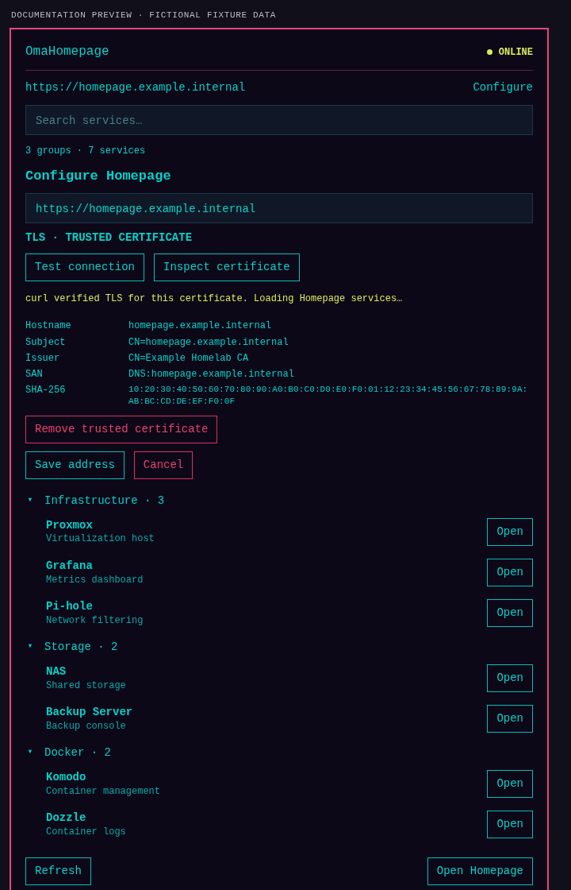
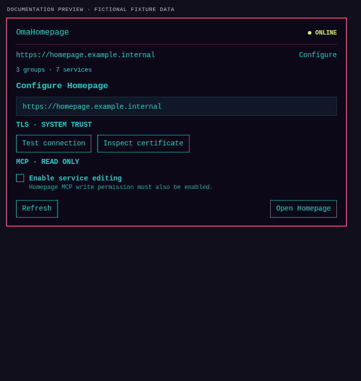
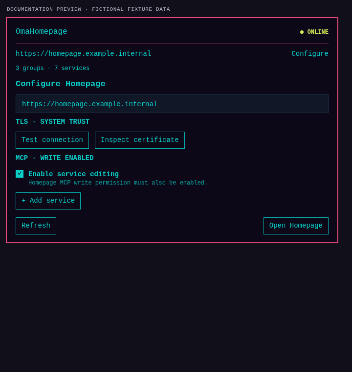
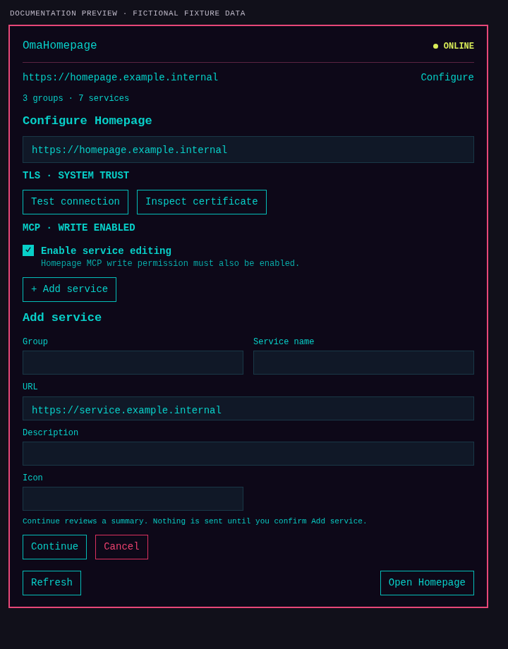
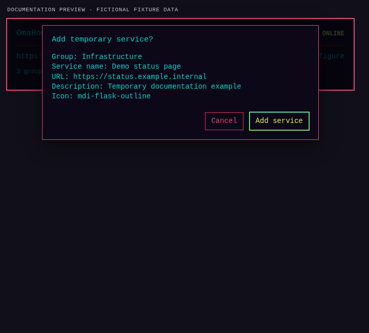
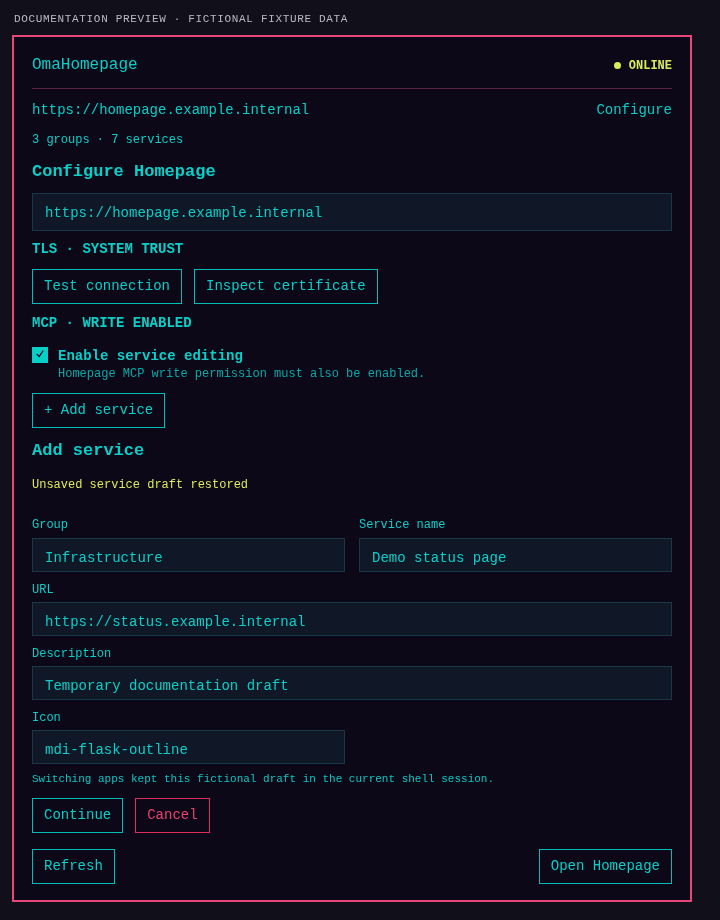

# OmaHomepage

OmaHomepage is a native Omarchy/Quickshell plugin for browsing services from a gethomepage/Homepage dashboard. It provides a bar widget and a service that reads Homepage's `GET /api/services`, lets you search and open service links, and optionally connects to Homepage MCP.

Every listed service has no claimed health result: Homepage's services API does not establish whether a backend is reachable. Rows with no reliable service status are shown without an invented `ONLINE` or `OFFLINE` state. OmaHomepage does not connect to Docker or probe individual services.

## Requirements

**Runtime**

- Omarchy with native plugin support (Quickshell)
- Homepage with `GET /api/services` enabled
- `curl` 8.4 or newer in `/usr/bin` or `/bin`
- Python 3 and the OpenSSL command-line tools for certificate inspection and private-CA/certificate trust

**Optional MCP**

- Homepage MCP, a compatible Secret Service provider, and `secret-tool` for storing and retrieving the MCP token. `secret-tool` is also used by `scripts/store-secret`.

**Tests and screenshot generation only**

- Node.js for JavaScript tests and screenshot generation; it is not required to run the plugin
- Python 3 and OpenSSL are also used by certificate tests

## Install with Omarchy

Install OmaHomepage from its public GitHub repository with the official Omarchy plugin commands:

```sh
omarchy plugin add https://github.com/danielfuentespl/omarchy-homepage --yes
omarchy plugin enable com.blogvirtualizado.omaops.homepage --section right
```

`plugin add` installs the plugin. `plugin enable` activates it, and `--section right` places its widget in the right side of the bar. To use the interactive install flow, omit `--yes`:

```sh
omarchy plugin add https://github.com/danielfuentespl/omarchy-homepage
omarchy plugin enable com.blogvirtualizado.omaops.homepage --section right
```

## First setup

1. Open OmaHomepage from its bar widget.
2. Choose **Configure**.
3. Enter the Homepage address, for example:
   - HTTP without an MCP token: `http://homepage.example.internal:3000`
   - HTTPS: `https://homepage.example.internal`
4. For HTTPS, choose **Test connection** to inspect the presented TLS certificate and verify the connection path. For plain HTTP there is no TLS certificate to inspect; check for `ONLINE` and use **Refresh** to confirm the service listing.
5. Choose **Save address**.

`ONLINE` means OmaHomepage can read Homepage's service API. `TLS · UNTRUSTED` means the HTTPS certificate is not trusted yet and needs inspection and an explicit trust choice, or a valid CA import. `TLS · TRUSTED CERTIFICATE` means the exact confirmed server certificate is in use for this origin. A connection error means Homepage did not return usable service data; check the address, network reachability, and TLS state shown in Configure.


## TLS and private certificates

If the server certificate is valid for the system trust store, no import or manual trust is needed. OmaHomepage uses normal system TLS validation.

OmaHomepage never disables TLS verification. It does not use `-k` or `--insecure`, and it has no “ignore TLS” option. Do not use insecure curl commands as a workaround.

### Option A: Trust this certificate

Use this for a self-signed certificate or a certificate from a private CA unknown to the system when you want to approve only the exact certificate currently presented by Homepage.

1. Open **Configure** and enter the HTTPS address.
2. Choose **Test connection**. If the state is **TLS · UNTRUSTED**, choose **Inspect certificate**.
3. Check the hostname, subject, issuer, SAN, validity dates, and SHA-256 fingerprint.
4. Choose **Trust this certificate**, review the confirmation, and approve it explicitly.
5. OmaHomepage saves only the public certificate for this Homepage origin and verifies it with a real API request. The state should become **TLS · TRUSTED CERTIFICATE**; then wait for services to load.
6. If services do not appear automatically, choose **Refresh**.




Trust is bound to the configured origin and exact leaf certificate. A renewed or otherwise changed certificate requires inspection and approval again. **Remove trusted certificate** removes OmaHomepage's explicit trust so the next connection uses normal system trust.


### Option B: Import CA certificate

Use this when you control a private CA and want to trust its valid renewals for this Homepage origin.

1. Obtain the CA's **public PEM certificate**.
2. In Configure, enter its absolute file path.
3. Choose **Import CA certificate**. OmaHomepage validates that the file contains a public CA certificate and that the CA verifies the live server certificate and hostname.
4. Choose **Test connection** again if needed, then save the Homepage address.

Never import a private key, a `rootCA-key.pem` file, or a PEM containing `PRIVATE KEY`. Import only the public CA certificate. CA trust is scoped to the configured origin and does not modify the system trust store.

### What the connection controls do

- **Test connection** inspects the current HTTPS certificate and checks the connection path. Certificate inspection applies only to HTTPS; a plain HTTP address has no TLS certificate.
- **Save address** stores the configured Homepage URL and starts loading its services.
- **Refresh** makes a new read-only request to Homepage and updates the visible groups and services. When MCP is enabled, it may also refresh MCP availability/capabilities using read-only requests. It does not change TLS trust, modify Homepage configuration, write `services.yaml`, or restart services.

Use **Refresh** after changing Homepage externally, after resolving a TLS issue if the list has not appeared, or whenever you want the displayed list updated. It is not normally necessary immediately after a successful connection because OmaHomepage loads services automatically.

## Use without MCP

MCP is optional. Without an MCP token, OmaHomepage uses `/api/services` and can:

- List groups and services
- Search by service name, description, or group
- Open service links and **Open Homepage**
- Refresh the displayed service list

HTTP is allowed only for this unauthenticated, read-only usage without an MCP token. If Homepage itself requires a browser login (`HOMEPAGE_AUTH_ENABLED=true`), its API may return **AUTH REQUIRED**: the MCP token does not authenticate `/api/services`, and OmaHomepage does not request or store a Homepage browser cookie.

## Optional MCP read-only access

Homepage MCP requires Homepage v2.0.0 or newer; OmaHomepage has been validated with Homepage 2.4.0. MCP is independent of normal service browsing.

1. Enable MCP on the Homepage server with `HOMEPAGE_MCP_ENABLED=true`, following Homepage's own configuration instructions.
2. If using a token, create it according to Homepage's instructions and keep it secret. Never put a real token in documentation, screenshots, shell history, or plugin settings.
3. Configure a valid HTTPS address in OmaHomepage. **MCP and MCP tokens require HTTPS with successful TLS validation**; HTTP plus a token is always rejected.
4. Store the token in Secret Service. With `secret-tool` installed, the plugin helper prompts without echoing the token:

   ```sh
   "${XDG_CONFIG_HOME:-$HOME/.config}/omarchy/plugins/com.blogvirtualizado.omaops.homepage/scripts/store-secret" default
   ```

5. Open OmaHomepage. With the token authenticated, the status reports **MCP READ ONLY** unless both the server-side write capability and the local editing permission are enabled.
6. Choose **View services.yaml** to inspect it read-only. OmaHomepage warns first because the file may contain sensitive values; the content is shown locally and is not persisted by the plugin.



## Add a service with MCP write

MCP write is disabled by default and requires both independent permissions:

1. On Homepage, enable `HOMEPAGE_MCP_ALLOW_WRITE=true` as well as `HOMEPAGE_MCP_ENABLED=true`.
2. In OmaHomepage Configure, explicitly select **Enable service editing**. This local permission is temporary and is not stored in plugin settings.
3. When the server confirms write capability, OmaHomepage shows **MCP WRITE ENABLED** and **+ Add service**.
4. Open **+ Add service** and fill in **Group**, **Service name**, **URL**, optional **Description**, and optional **Icon**.
5. Choose **Continue** and review the summary.
6. Choose **Add service** in the confirmation to send the write.

**Continue does not write anything.** The service is written only after the explicit confirmation, then OmaHomepage reads `services.yaml` back to verify the result. OmaHomepage offers this constrained Add service operation only; it is not a general YAML editor and it does not offer arbitrary YAML editing.







If a service draft is in progress and you switch to Firefox, Zen, or another application, returning to OmaHomepage during the same Omarchy Shell session restores the draft and its temporary editing authorization. The draft exists only in memory; it is not saved to disk. **Cancel** discards it. Adding the service successfully also clears it. Restarting Omarchy Shell clears the session state.



With long service lists, Configure or Add service can sit partly below the visible panel area. Scroll inside the panel with the mouse wheel, touchpad, or scrollbar to reach the rest of the form. This is expected when the content is taller than the viewport.

## Troubleshooting

| Symptom | What to check |
| --- | --- |
| **TLS · UNTRUSTED** | Inspect the hostname, validity, issuer, and fingerprint. Use **Trust this certificate** for the exact leaf or **Import CA certificate** with the public CA PEM. |
| Homepage does not load after trusting | Wait a few seconds for the API request. If groups and services still do not appear, choose **Refresh**. |
| **MCP UNAVAILABLE** | Check that Homepage is version 2.0.0 or newer and `HOMEPAGE_MCP_ENABLED=true`. Normal browsing can still work without MCP. |
| **MCP READ ONLY** when you want to add a service | Check server-side `HOMEPAGE_MCP_ALLOW_WRITE=true`, token authentication, HTTPS, and the local **Enable service editing** checkbox. |
| **+ Add service** is not visible | Enable service editing after server write capability is confirmed. With a long list, scroll inside the panel. |
| Services look out of date | Choose **Refresh**. |
| Homepage certificate changed | Inspect the new certificate and explicitly approve it again only if you trust the change. |
| Connection error | Check the URL, network path, Homepage API access, and—when using HTTPS—the certificate state. |

## Security and limitations

- curl uses `-q --config -`; request configuration and tokens are sent through stdin, not process arguments or environment variables.
- Redirects are never followed. TLS verification is always enabled; custom CA or leaf trust is limited to the configured origin.
- Service responses and displayed fields are bounded. Service status is not inferred from configuration metadata.
- Safe HTTP(S) links open through Qt without shell command construction.
- The plugin runs inside `omarchy-shell` and is not a sandbox boundary. It does not use a Docker socket, SSH, browser cookies, or Homepage session credentials.
- See [Security notes](docs/SECURITY.md) and [Development](DEVELOPMENT.md).

## Project

- Version: `0.1.0`
- License: MIT
- Independent project; not affiliated with, sponsored by, or endorsed by Homepage or Omarchy.
